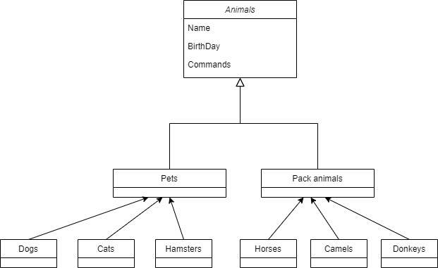

## Итоговая контрольная работа по блоку специализация ##


### Информация о проекте ###
Необходимо организовать систему учета для питомника в котором живут 
домашние и Pack animals.


### Как сдавать проект ### 
Для сдачи проекта необходимо создать отдельный общедоступный репозиторий(Github, 
gitlub, или Bitbucket). Разработку вести в этом репозитории, использовать 
пул реквесты на изменения. Программа должна запускаться и работать, 
ошибок при выполнении программы быть не должно. 
Программа, может использоваться в различных системах, поэтому необходимо 
разработать класс в виде конструктора


# Задание #

## Операционные системы и виртуализация (Linux) ##

**1. Использование команды cat в Linux**
    
- Создать два текстовых файла: "Pets"(Домашние животные) и "Pack animals"(вьючные животные), используя команду `cat` в терминале Linux. В первом файле перечислить собак, кошек и хомяков. Во втором — лошадей, верблюдов и ослов.
- Объединить содержимое этих двух файлов в один и просмотреть его содержимое.
- Переименовать получившийся файл в "Human Friends"(.
Пример конечного вывода после команды “ls” :
Desktop Documents Downloads  HumanFriends.txt  Music  PackAnimals.txt  Pets.txt  Pictures  Videos

- Создаем файл Pets.txt и записываем в него Домашние животные (собаки, кошки и хомяки)
```
$ cat > Pets.txt
Fido
Whiskers
Hammy
Buddy
mudge
Peanut
Bella
Oliver
```
<u> Завершаем ввод командой Ctrl + D </u>

- Просмотр содержимого файла Pets.txt
```
$ cat Pets.txt
```
- Создаем файл PackAnimals.txt и записываем в него Вьючные животные (лошадей, верблюдов и ослов)
```  
$ cat > PackAnimals.txt
```
- Объединяем созданные файлы Pets.txt и PackAnimals.txt в один файл HumanFriends.txt
```  
$ cat Pets.txt PackAnimals.txt > HumanFriends.txt
```
- Чтение файлов
```
$ ls
app.py                nginx-conf        test2            Изображения
del_backupfiles.sh    PackAnimals.txt   test_lxc_1.log   Музыка
dir1                  Pets.txt          test.yaml        Общедоступные
docker-compose.yaml   script1.sh        wordpress       'Рабочий стол'
Dockerfile            sem3              Видео            Шаблоны
gb                    shared            Документы
HumanFriends.txt      snap              Загрузки
```

**2. Работа с директориями в Linux**
    
- Создать новую директорию и переместить туда файл "Human Friends".

- создаем новый каталог ItogKR
```
$ mkdir ItogKR
```
- перемещаем в каталог ItogKR файл HumanFriends.txt
```
$ mv HumanFriends.txt ItogKR/
```
- чтение каталога ItogKR
```
$ ls ItogKR/
HumanFriends.txt
```
**3. Работа с MySQL в Linux. “Установить MySQL на вашу вычислительную машину”**
- Подключить дополнительный репозиторий MySQL и установить один из пакетов из этого репозитория.
- 
- Установка MySQL
```
$ sudo apt update
$ sudo apt install mysql-server-8.0.36
```
- Проверка установки
```
$ sudo systemctl status mysql
● mysql.service - MySQL Community Server
     Loaded: loaded (/lib/systemd/system/mysql.service; enabled; vendor preset:>
     Active: active (running) since Tue 2024-04-02 09:15:59 MSK; 49min ago
   Main PID: 1538 (mysqld)
     Status: "Server is operational"
      Tasks: 37 (limit: 2261)
     Memory: 5.3M
        CPU: 13.926s
     CGroup: /system.slice/mysql.service
             └─1538 /usr/sbin/mysqld

апр 02 09:15:25 db-linux systemd[1]: Starting MySQL Community Server...
апр 02 09:15:59 db-linux systemd[1]: Started MySQL Community Server.
```
- Проверка версии MySQL
  $ mysql --version
```
mysql  Ver 8.0.36-0ubuntu0.22.04.1 for Linux on x86_64 ((Ubuntu))
```

2.1. Установка дополнительных продуктов и компонентов MySQL

- Обновляем информацию о пакете из репозитория MySQL APT
```
$ sudo apt-get update
```

- Установка дополнительного пакета WorkBench
```
$ sudo apt-get install mysql-workbench-community
```

- Установка клиентских библиотек для работы с WorkBench
```
$ sudo apt-get install libmysqlclient21
```

**4. Управление deb-пакетами**
Установить и затем удалить deb-пакет, используя команду `dpkg`.
  
- скачиваем virtualbox
```
$ wget https://download.virtualbox.org/virtualbox/7.0.14/virtualbox-7.0_7.0.14-161095~Ubuntu~jammy_amd64.deb
```
- установка virtualbox
```
$ dpkg -i virtualbox-7.0_7.0.6-155176Ubuntujammy_amd64.deb
```
- удаление virtualbox
```
$ dpkg -P virtualbox-7.0
```
**5. История команд в терминале Ubuntu.**

Сохранить и выложить историю ваших терминальных команд в Ubuntu.
В формате: Файла с ФИО, датой сдачи, номером группы(или потока)

- Сохраняем историю команд в файл
```
$ history > Agadadashev_Aslan_A_05_04_2024.txt
```

**6. Диаграмма классов**

Создать диаграмму классов с родительским классом "Животные", и двумя подклассами: "Pets" и "Pack animals".
В составы классов которых в случае Pets войдут классы: собаки, кошки, хомяки, а в класс Pack animals войдут: Лошади, верблюды и ослы).
Каждый тип животных будет характеризоваться (например, имена, даты рождения, выполняемые команды и т.д)
Диаграмму можно нарисовать в любом редакторе, такими как Lucidchart, Draw.io, Microsoft Visio и других.



**7. Работа с MySQL (Задача выполняется в случае успешного выполнения задачи “Работа с MySQL в Linux.
   “Установить MySQL на вашу машину”**

7.1. После создания диаграммы классов в 6 пункте, в 7 пункте база данных "Human Friends"
должна быть структурирована в соответствии с этой диаграммой. Например, можно создать таблицы,
которые будут соответствовать классам "Pets" и "Pack animals", и в этих таблицах будут поля,
которые характеризуют каждый тип животных (например, имена, даты рождения, выполняемые команды и т.д.).

7.2 В ранее подключенном MySQL создать базу данных с названием "Human Friends".

- Создать таблицы, соответствующие иерархии из вашей диаграммы классов.
- Заполнить таблицы данными о животных, их командах и датами рождения.
```
-- Создаем БД Human_friend.
DROP DATABASE IF EXISTS Human_friend;
CREATE DATABASE Human_friend;

USE Human_friend;

-- Создаем таблицу animal и заполняем данными
DROP TABLE IF EXISTS animal;
CREATE TABLE animal (
id INT AUTO_INCREMENT PRIMARY KEY,
animal_name VARCHAR(25)
);

INSERT INTO
animal (animal_name)
VALUES
('Pets'),
('Pack_Animals');

-- Создаем таблицу pet и заполняем данными
DROP TABLE IF EXISTS pet;
CREATE TABLE pet (
id INT AUTO_INCREMENT PRIMARY KEY,
animal_id INT,
pet_name VARCHAR (25),
FOREIGN KEY (animal_id) REFERENCES animal (id) ON DELETE CASCADE ON UPDATE CASCADE
);

INSERT INTO
pet (animal_id, pet_name )
VALUES
(1, 'Cat'),
(1, 'Dog'),  
(1, 'Hamster');

-- Создаем таблицу pack_animal и заполняем данными
DROP TABLE IF EXISTS pack_animal;
CREATE TABLE pack_animal (
id INT AUTO_INCREMENT PRIMARY KEY,
animal_id INT,
pack_animal_name VARCHAR (25),
FOREIGN KEY (animal_id) REFERENCES animal (id) ON DELETE CASCADE ON UPDATE CASCADE
);

INSERT INTO
pack_animal (animal_id, pack_animal_name )
VALUES
(2, 'Horses'),
(2, 'Donkeys'),  
(2, 'Camels');

-- Создаем таблицу cat и заполняем данными
DROP TABLE IF EXISTS cat;
CREATE TABLE cat (       
id INT AUTO_INCREMENT PRIMARY KEY,
pet_id INT,
cat_name VARCHAR(25),
birthday DATE,
command VARCHAR(45),
FOREIGN KEY (pet_id) REFERENCES pet (id) ON DELETE CASCADE ON UPDATE CASCADE
);

INSERT INTO
cat (pet_id, cat_name, birthday, command)
VALUES
(1, 'Whiskers', '2019-05-15', 'Sit, Pounce'),
(1, 'Smudge', '2020-02-20', 'Sit, Pounce, Scratch'),  
(1, 'Oliver', '2020-06-30', 'Meow, Scratch, Jump');

-- Создаем таблицу dog и заполняем данными
DROP TABLE IF EXISTS dog;
CREATE TABLE dog (       
id INT AUTO_INCREMENT PRIMARY KEY,
pet_id INT,
dog_name VARCHAR(25),
birthday DATE,
command VARCHAR(45),
FOREIGN KEY (pet_id) REFERENCES pet (id) ON DELETE CASCADE ON UPDATE CASCADE
);

INSERT INTO
dog (pet_id, dog_name, birthday, command)
VALUES
( 2, 'Fido','2020-01-01', 'Sit, Stay, Fetch'),
( 2, 'Buddy','2018-12-10', 'Sit, Paw, Bark'),  
( 2, 'Bella','2019-11-11', 'Sit, Stay, Roll');

-- Создаем таблицу hamster и заполняем данными
DROP TABLE IF EXISTS hamster;
CREATE TABLE hamster (       
id INT AUTO_INCREMENT PRIMARY KEY,
pet_id INT,
hamster_name VARCHAR(25),
birthday DATE,
command VARCHAR(45),
FOREIGN KEY (pet_id) REFERENCES pet (id) ON DELETE CASCADE ON UPDATE CASCADE
);

INSERT INTO
hamster (pet_id, hamster_name, birthday, command)
VALUES
( 3, 'Hammy','2021-03-10', 'Roll, Hide'),
( 3, 'Peanut', '2021-08-01', 'Roll, Spin');

-- Создаем таблицу horse и заполняем данными
DROP TABLE IF EXISTS horse;  
CREATE TABLE horse (       
id INT AUTO_INCREMENT PRIMARY KEY,
pack_animal_id INT,
horse_name VARCHAR(25),
birthday DATE,
command VARCHAR(45),
FOREIGN KEY (pack_animal_id) REFERENCES pack_animal (id) ON DELETE CASCADE ON UPDATE CASCADE
);

INSERT INTO
horse (pack_animal_id, horse_name, birthday, command)
VALUES
(1, 'Thunder', '2015-07-21', 'Trot, Canter, Gallop'),
(1, 'Storm', '2014-05-05', 'Trot, Canter'),  
(1, 'Blaze', '2016-02-29', 'Trot, Jump, Gallop');

-- Создаем таблицу donkey и заполняем данными
DROP TABLE IF EXISTS donkey;
CREATE TABLE donkey (       
id INT AUTO_INCREMENT PRIMARY KEY,
pack_animal_id INT,
donkey_name VARCHAR(25),
birthday DATE,
command VARCHAR(45),
FOREIGN KEY (pack_animal_id) REFERENCES pack_animal (id) ON DELETE CASCADE ON UPDATE CASCADE
);

INSERT INTO
donkey (pack_animal_id, donkey_name, birthday, command)
VALUES
(2, 'Eeyore', '2017-09-18', 'Walk, Carry Load, Bray'),
(2, 'Burro', '2019-01-23', 'Walk, Bray, Kick');

-- Создаем таблицу camel и заполняем данными
DROP TABLE IF EXISTS camel;
CREATE TABLE camel (       
id INT AUTO_INCREMENT PRIMARY KEY,
pack_animal_id INT,
camel_name VARCHAR(25),
birthday DATE,
command VARCHAR(45),
FOREIGN KEY (pack_animal_id) REFERENCES pack_animal (id) ON DELETE CASCADE ON UPDATE CASCADE
);

INSERT INTO
camel (pack_animal_id, camel_name, birthday, command)
VALUES
(3, 'Sandy', '2016-11-03', 'Walk, Carry Load'),
(3, 'Dune', '2018-12-12', 'Walk, Sit'),
(3, 'Sahara', '2015-08-14', 'Walk, Run');
```

- Удалить записи о верблюдах и объединить таблицы лошадей и ослов.
```
-- Удалить записи о верблюдах и объединить таблицы лошадей и ослов.
DELETE FROM camel; 
 
CREATE TABLE horse_and_donkey 
SELECT * FROM horse
	UNION 
SELECT * FROM donkey;
```

- Создать новую таблицу для животных в возрасте от 1 до 3 лет и вычислить их возраст с точностью до месяца.
```
-- Создать новую таблицу для животных в возрасте от 1 до 3 лет и вычислить их возраст с точностью до месяца.
DROP TABLE IF EXISTS animal_1_3;
CREATE TABLE animal_1_3
SELECT
	cat_name AS name, birthday, command, TIMESTAMPDIFF(MONTH, birthday, CURDATE()) AS age
FROM cat
UNION
SELECT
	dog_name AS name, birthday, command, TIMESTAMPDIFF(MONTH, birthday, CURDATE()) AS age
FROM dog
UNION
SELECT
	hamster_name AS name, birthday, command, TIMESTAMPDIFF(MONTH, birthday, CURDATE()) AS age
FROM hamster
UNION
SELECT
	horse_name AS name, birthday, command, TIMESTAMPDIFF(MONTH, birthday, CURDATE()) AS age
FROM horse
UNION
SELECT
	horse_name AS name, birthday, command, TIMESTAMPDIFF(MONTH, birthday, CURDATE()) AS age
FROM horse
UNION
SELECT
	donkey_name AS name, birthday, command, TIMESTAMPDIFF(MONTH, birthday, CURDATE()) AS age
FROM donkey
UNION
SELECT
	camel_name AS name, birthday, command, TIMESTAMPDIFF(MONTH, birthday, CURDATE()) AS age
FROM camel
WHERE birthday BETWEEN ADDDATE(CURDATE(), INTERVAL -3 YEAR) AND ADDDATE(CURDATE(), INTERVAL -1 YEAR);
```
- Объединить все созданные таблицы в одну, сохраняя информацию о принадлежности к исходным таблицам.
```
DROP TABLE IF EXISTS all_animals;
CREATE TABLE all_animals
SELECT 
	c.cat_name,
	pe.pet_name, 
	c.birthday, 
	c.command,
	an.animal_name
FROM cat c
LEFT JOIN pet pe ON pe.id = c.pet_id
LEFT JOIN animal an ON an.id = pe.animal_id
UNION
SELECT 
	d.dog_name,
	pe.pet_name, 
	d.birthday, 
	d.command,
	an.animal_name
FROM dog d
LEFT JOIN pet pe ON pe.id = d.pet_id
LEFT JOIN animal an ON an.id = pe.animal_id
UNION
SELECT 
	h.hamster_name,
	pe.pet_name, 
	h.birthday, 
	h.command,
	an.animal_name
FROM hamster h
LEFT JOIN pet pe ON pe.id = h.pet_id
LEFT JOIN animal an ON an.id = pe.animal_id
UNION
SELECT 
	h.horse_name,
	pa.pack_animal_name, 
	h.birthday, 
	h.command,
	an.animal_name
FROM horse h
LEFT JOIN pack_animal pa ON pa.id = h.pack_animal_id
LEFT JOIN animal an ON an.id = pa.animal_id
UNION
SELECT 
	d.donkey_name,
	pa.pack_animal_name, 
	d.birthday, 
	d.command,
	an.animal_name
FROM donkey d
LEFT JOIN pack_animal pa ON pa.id = d.pack_animal_id
LEFT JOIN animal an ON an.id = pa.animal_id
UNION
SELECT 
	cl.camel_name,
	pa.pack_animal_name, 
	cl.birthday, 
	cl.command,
	an.animal_name
FROM camel cl
LEFT JOIN pack_animal pa ON pa.id = cl.pack_animal_id
LEFT JOIN animal an ON an.id = pa.animal_id
```
**8. ООП и Java**
- Создать иерархию классов в Java, который будет повторять диаграмму классов созданную в задаче 6(Диаграмма классов).

**9. Программа-реестр домашних животных**
- Написать программу на Java, которая будет имитировать реестр домашних животных.
  Должен быть реализован следующий функционал:

9.1. Добавление нового животного
- Реализовать функциональность для добавления новых животных в реестр. Животное должно определяться в правильный класс (например, "собака", "кошка", "хомяк" и т.д.)

9.2. Список команд животного
- Вывести список команд, которые может выполнять добавленное животное (например, "сидеть", "лежать").

9.3. Обучение новым командам
- Добавить возможность обучать животных новым командам.

9.4 Вывести список животных по дате рождения

9.5. Навигация по меню
- Реализовать консольный пользовательский интерфейс с меню для навигации между вышеуказанными функциями.

**10. Счетчик животных**
    
- Создать механизм, который позволяет вывести на экран общее количество созданных животных любого типа (Как домашних, так и вьючных), то есть при создании каждого нового животного счетчик увеличивается на “1”.

Задания 8, 9 и 10 реализованы в проекте Animal
```
https://github.com/AslanBitPlus/ItogKR.git
```
